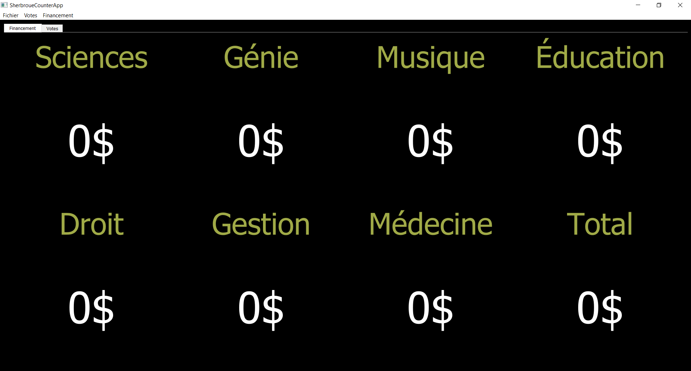

# SherbroueThing
A small application I made for Sherbroue in which they asked for a way to track their votes and the money raised
Features:
* Add money or with a shortcut
* Set amount of votes or money by clicking the title
* Save current status in a CSV file
* Open a CSV file saved in the same manner

